# Laporan Praktikum Sistem Operasi 2

<h4>Nama : Dafa Naufal Rabbani<h4>
<h4>Nim : 254107020086<h4>
<h4>Kelas : TI-1G<h4>

## Praktikum 2.1 - Identifikasi CPU dan Memori

Kode 1.1 : Melihat informasi CPU

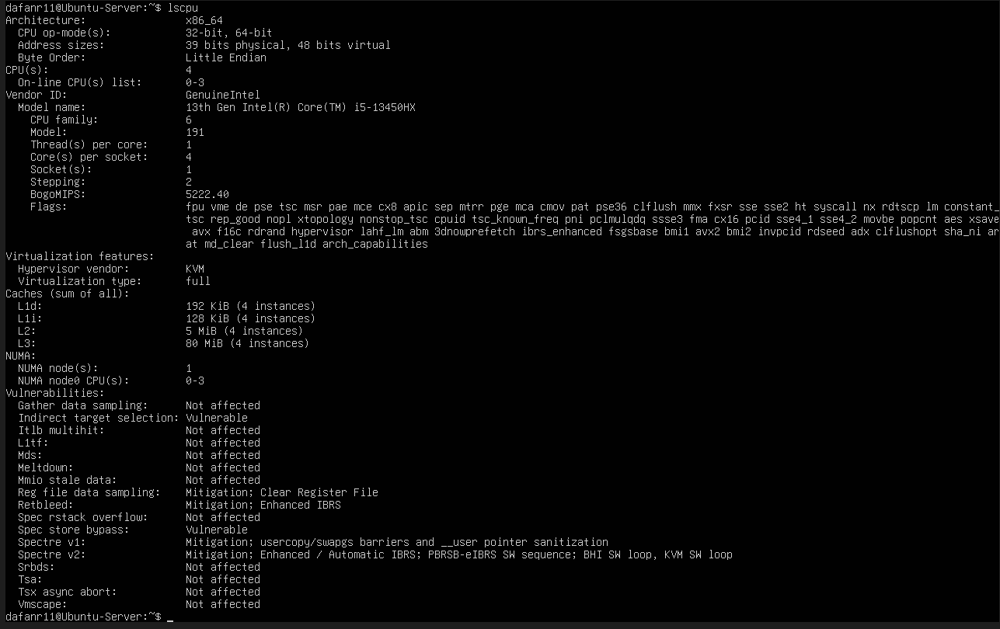

Kode 1.2 : Melihat penggunaan memori

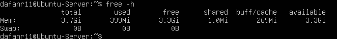

Kode 1.3 : Informasi DMI

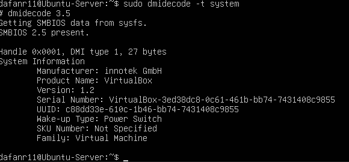

#### Latihan 2.1

Catat: (1) jumlah CPU(s), core/thread, (2) total RAM, (3) total swap. Jelaskan perbedaan RAM vs swap dalam 2–3 kalimat.

>Jawaban :
>1. Jumlah CPU(s) : 6
>2. Jumlah Core(s) per socket : 4
>3. Jumlah Thread(s) per core : 1  
>4. Total RAM : 3.7Gi  
>5. Total Swap : 0B  

>Perbedaan RAM vs swap adalah RAM yaitu memori fisik cepat yang digunakan untuk menyimpan data dan program yang sedang aktif sedangkan swap adalah ruang di harddisk yang digunakan sebagai "RAM cadangan" ketika RAM fisik penuh. Swap lebih lambat dari RAM, sehingga penggunaan swap berlebihan dapat memperlambat sistem

## Praktikum 2.2 - Identifikasi Perangkat PCI/USB dan Driver

Kode 1.4 : Daftar perangkat PCI (ringkas)

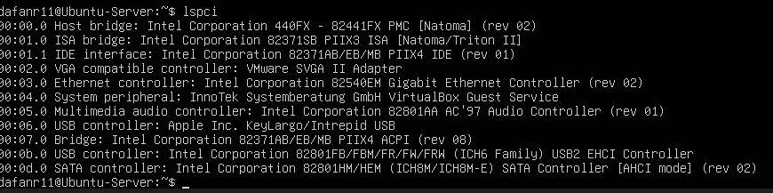

Kode 1.5: Melihat driver perangkat PCI

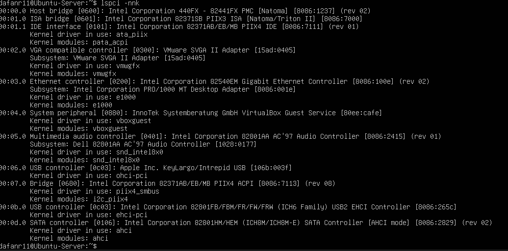

Kode 1.6: Mencari info NIC dan drivernya

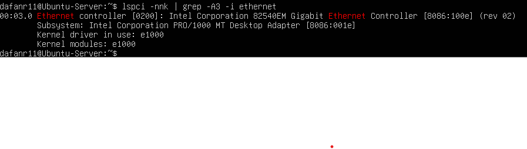

Kode 1.7: Daftar perangkat USB

Kode 1.8: Topologi perangkat USB

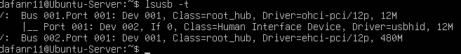

#### Latihan 2.2

Temukan 1 perangkat PCI (misal NIC) dan tuliskan: Vendor:Device ID (angka
heksadesimal), nama driver/modul kernel, dan deskripsi singkat fungsinya. 

>Jawaban :  
>1. Perangkat --> Network Interface Controller (NIC)
>2. Vendor:Device ID -->  8086:001e  
>3. Nama driver/modul -->	e1000  
>4. Deskripsi fungsi --> MPerangkat ini adalah kartu jaringan berbasis Intel PRO/1000 yang berfungsi untuk menghubungkan sistem ke jaringan (LAN). Driver e1000 memungkinkan sistem operasi Linux mengenali dan mengelola komunikasi data melalui perangkat tersebut sehingga server dapat mengirim dan menerima paket data melalui jaringan.

## Praktikum 2.3 — Identifikasi Storage dan Filesystem

Kode 1.9: Melihat block device dan filesystem

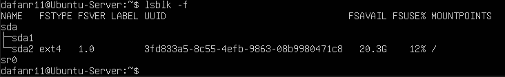

Kode 1.10: Melihat UUID filesystem

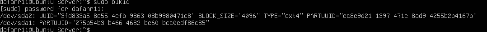

Kode 1.11: Melihat device untuk root filesystem

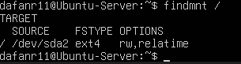

## Praktikum 2.4 — Melihat Modul Aktif dan Informasinya

Kode 1.13: Cek versi kernel

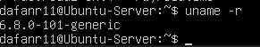

Kode 1.14: Daftar modul aktif

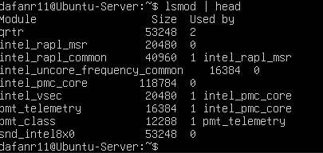

Kode 1.15: Detail modul dengan modinfo

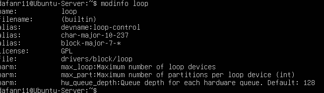

Kode 1.16: Load modul dan verifikasi

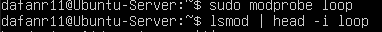

Kode 1.17: Cek log kernel terbaru

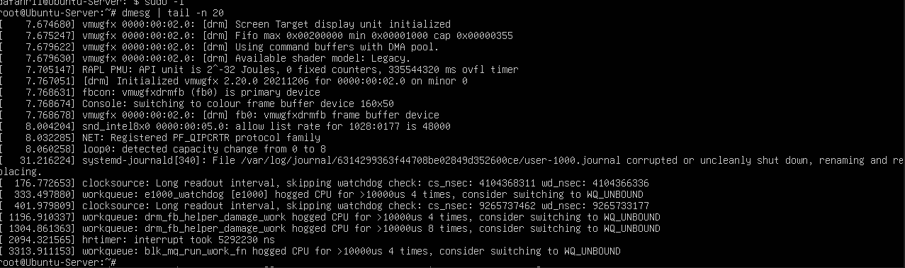

## Praktikum 2.5 — Konfigurasi Auto-load dan Blacklist

Kode 1.18: Menambahkan modul untuk auto-load (demo)

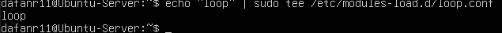

Kode 1.19: Verifikasi modul aktif

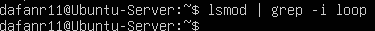

Kode 1.20: Contoh blacklist modul (jangan diterapkan sembarangan)

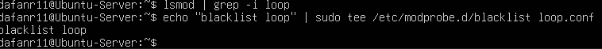

## Praktikum 2.6 — Mengenali Block vs Character Device

Kode 1.21: Melihat detail device node disk

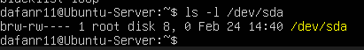

Kode 1.22: Melihat detail device node terminal

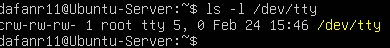

Kode 1.23: Mapping disk/partisi

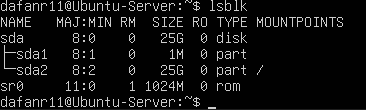

#### Latihan 2.3

Dari output ls -l, jelaskan perbedaan penanda file untuk block device dan
character device. (Hint: karakter pertama pada permission string)

>Jawaban :  
Dari output ls -l, perbedaannya terletak pada karakter pertama dari string permission  
>1. Block device → karakter pertama b  
Contoh: /dev/sda  
Fungsi: akses data per blok (hardisk, SSD)  
>2. Character device → karakter pertama c  
Contoh: /dev/tty  
Fungsi: akses data per karakter (terminal, keyboard)

## Praktikum 2.7 — Melihat Informasi udev

Kode 1.24: Melihat atribut udev untuk disk

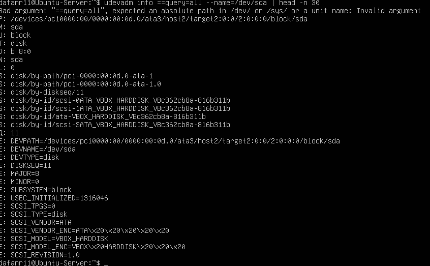

Kode 1.25: Monitor event udev (opsional)

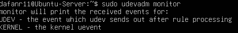

## Praktikum 2.8 — Membuat Workspace Praktikum

Kode 1.26: Membuat workspace praktikum

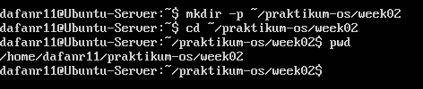

Kode 1.27: Membuat file contoh

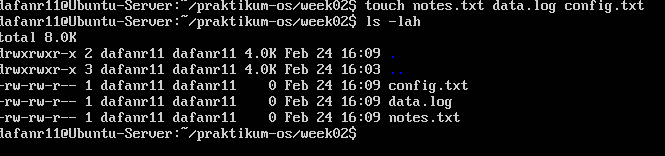

Kode 1.28: Mengisi file log contoh

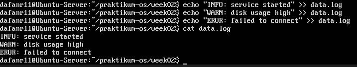

Kode 1.29: Membaca file dengan less

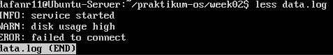

## Praktikum 2.9 — Pencarian Pola dengan grep

Kode 1.30: grep sederhana

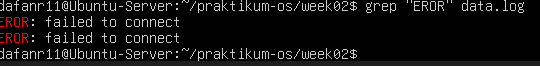

Kode 1.31: grep case-insensitive

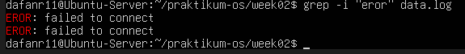

Kode 1.32: grep dengan nomor baris

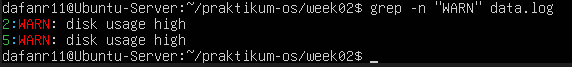

Kode 1.33: grep invert match

### Latihan 2.4

Gunakan grep untuk menampilkan hanya baris yang mengandung INFO atau WARN dari data.log. (Hint: gunakan grep -E dengan pola alternatif)

>Jawaban : 
.png)

## Praktikum 2.10 — Substitusi dengan sed (Aman di File Latihan)

Kode 1.34: Membuat file config latihan

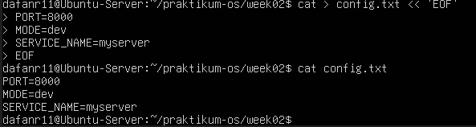

Kode 1.35: sed substitusi tanpa in-place

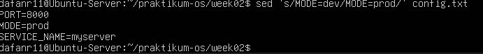

Kode 1.36: sed in-place

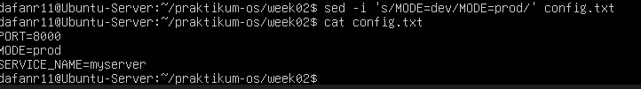

Kode 1.37: sed global replacement

## Praktikum 2.11 — Ekstraksi Kolom dengan awk

Kode 1.38: Output df -h

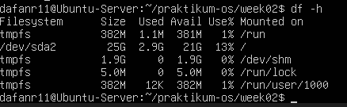

Kode 1.39: awk print kolom tertentu

Kode 1.40: awk filter berdasarkan kondisi

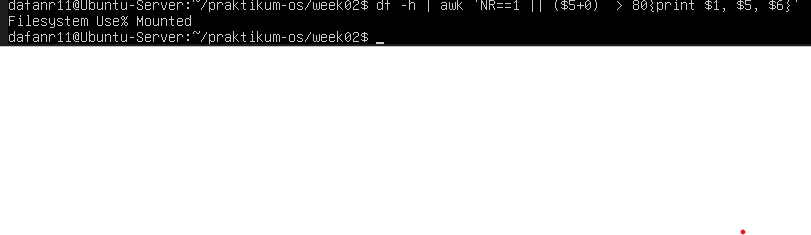

## Praktikum 2.12 — Melihat Proses dengan ps

Kode 1.41: ps aux

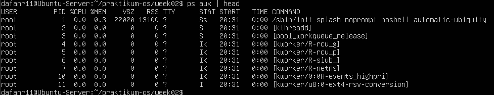

Kode 1.42: Filter proses dengan grep

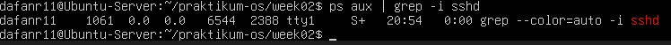

## Praktikum 2.13 — Monitoring Real-time dengan top

Kode 1.43: Menjalankan top

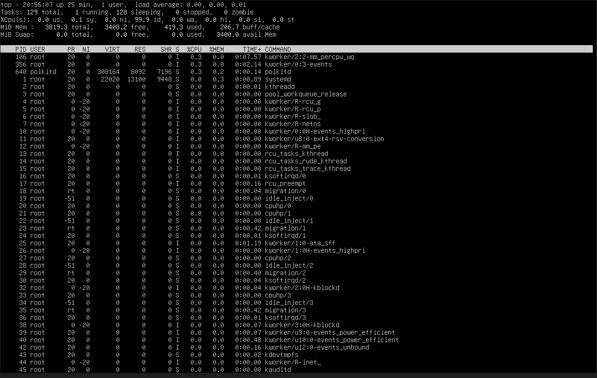

## Praktikum 2.14 — Menghentikan Proses dengan kill

Kode 1.44: Membuat proses dummy

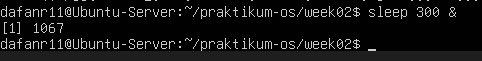

Kode 1.45: Mencari PID sleep

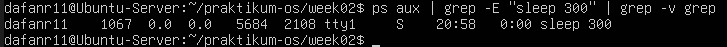

Kode 1.46: Mengirim SIGTERM

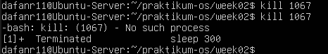

Kode 1.47: Verifikasi proses sudah berhenti

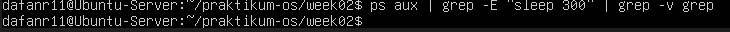

Kode 1.48: Mengirim SIGKILL (opsional)

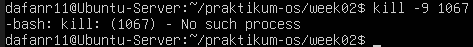

## Praktikum 2.15 — Cek Disk, Load, dan Service

Kode 1.49: Cek kapasitas disk

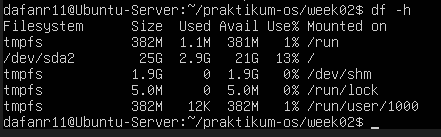

Kode 1.50: Cek ukuran direktori (contoh /var)

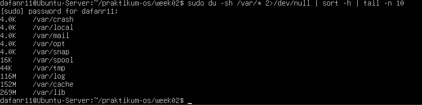

Kode 1.51: Cek load average

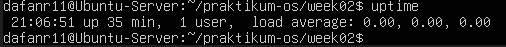

Kode 1.52: Service yang gagal

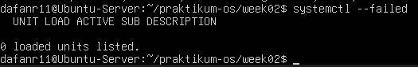

Kode 1.53: Log error terbaru

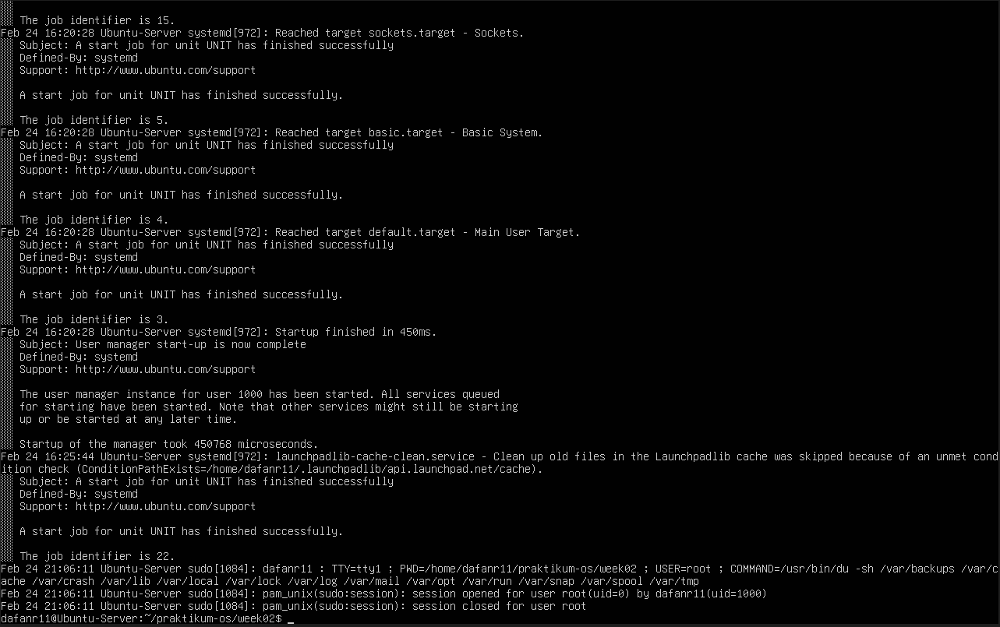

## Praktikum 2.16 — Monitoring Port dan Koneksi (Network Basics)

Kode 1.54: Cek IP address

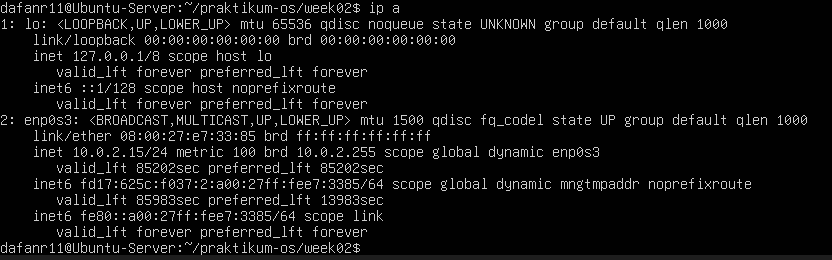

Kode 1.55: Cek routing

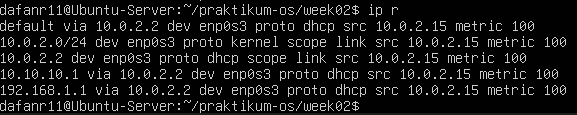

Kode 1.56: Cek port listening

### Latihan 2.5

Pilih satu port yang listening dari output ss -tulpn(misal port 22), lalu tuliskan service/proses yang membukanya. Jelaskan kegunaan port tersebut secara singkat.

>Jawaban :  
Port 53  
Port 53 digunakan untuk layanan DNS (Domain Name System). Service systemd-resolve berfungsi menangani resolusi nama domain menjadi alamat IP. Artinya, ketika server melakukan permintaan seperti mengakses google.com, service ini yang menerjemahkan nama domain tersebut menjadi alamat IP agar bisa terhubung ke server tujuan.

# Latihan

## Latihan 2.A
Jalankan lspci -nnk. Pilih 1 perangkat PCI dan tuliskan: nama perangkat, ID vendor:device, dan kernel driver in use.
>Jawaban :  
Nama Perangkat: Intel Corporation 82540EM Gigabit Ethernet Controller
Vendor:Device ID: 8086:100e
Kernel Driver in Use: e1000

## Latihan 2.B
Tentukan device root filesystem dengan findmnt /. Lalu cocokkan dengan lsblk -f dan tuliskan tipe filesystem serta UUID-nya.
>Jawaban :  
Device root filesystem: /dev/sda2
Tipe file
UUID: 3fd833a5-8c55-4efb-9863-08b9980471c8

## Latihan 2.C
Buat file server.log berisi minimal 10 baris dengan variasi kata: INFO, WARN, ERROR. Gunakan grep untuk menampilkan hanya baris ERROR.
>Jawaban :  

## Latihan 2.D
Gunakan sed untuk mengganti semua kata server menjadi node pada file latihan. Tunjukkan sebelum dan sesudah.
>Jawaban :  

## Latihan 2.E
Gunakan df -h lalu awk untuk menampilkan filesystem yang penggunaan disk di atas 70%.
>Jawaban :   
 

## Latihan 2.F
Jalankan sleep 600 &. Temukan PID-nya dengan ps. Hentikan dengan SIGTERM. Jelaskan beda SIGTERM vs SIGKILL.
>Jawaban :  
  
>SIGTERM adalah signal untuk menghentikan proses secara normal dan memberi kesempatan proses untuk melakukan cleanup sebelum berhenti. Sedangkan SIGKILL adalah signal untuk menghentikan proses secara paksa tanpa memberi kesempatan cleanup dan tidak bisa ditolak oleh proses. SIGTERM lebih aman digunakan, sedangkan SIGKILL digunakan jika proses tidak merespon SIGTERM.

## Latihan 2.G
Gunakan systemctl –failed. Jika tidak ada yang gagal, pilih satu service aktif (misal ssh) dan tampilkan status serta 30 baris log terakhirnya.
>Jawaban :  
ssh  
.png)
